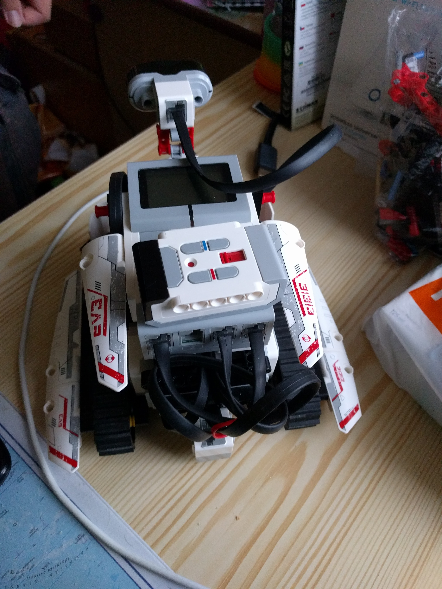

# EV3dev Auto Driver

Probably one of my most favorite projects for the EV3. This is simple yet quite effective program that allows the robot with tank like wheels and infrared sensor mounted to the motor such that it can rotate freely to drive continuously while steering away from obstacles. The robot looked similar to this one:

Idea of the algorithm is that by measuring the distance to the obstacles in three directions (left, right and front) where each direction is actually represented by a range of measurements in that direction, we can determine the best direction to steer the robot in order to avoid the obstacles. To recover from reaching the dead end, the robot will slow down when approaching head on collision and strength of steering will be increased this makes the regulator unstable and robot will start to oscillate until it at some point steers away from the obstacle as a distance to one of the sides becomes greater than the distance to the other one as the robot starts to steer away from the obstacle in front of it.

I remember leaving the robot running in the hallway and watching it drive around endlessly until the battery run out. While the infrared sensor is not good at detecting the obstacles that are thin or that doesn't reflect a lot of infrared light, it is still effective enough to avoid the walls and other big obstacles.

## Requirements

You'll need to install the ev3dev OS on your EV3 brick. You can find the instructions on the [ev3dev website](https://www.ev3dev.org/docs/getting-started/).

## Usage

To run the program, simply execute the `auto_drive.py` script. You might need to adjust constants in the script to match the robot you are using.
